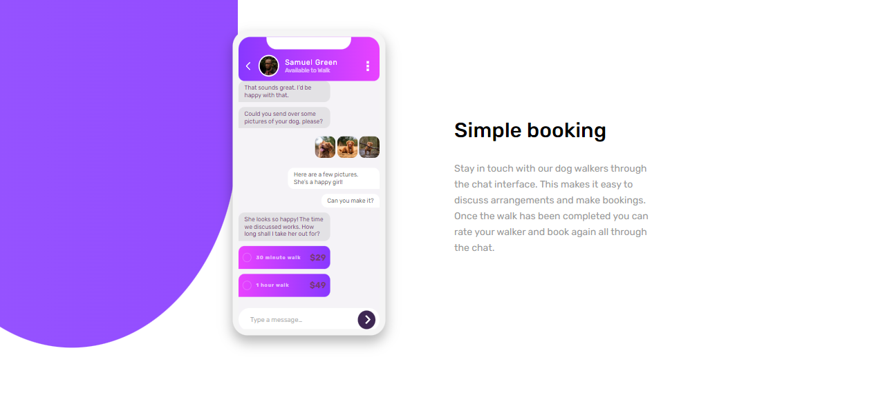

# Frontend Mentor - Chat app CSS illustration solution

This is a solution to the [Chat app CSS illustration challenge on Frontend Mentor](https://www.frontendmentor.io/challenges/chat-app-css-illustration-O5auMkFqY). Frontend Mentor challenges help you improve your coding skills by building realistic projects. 

## Table of contents

- [Frontend Mentor - Chat app CSS illustration solution](#frontend-mentor---chat-app-css-illustration-solution)
  - [Table of contents](#table-of-contents)
  - [Overview](#overview)
    - [The challenge](#the-challenge)
    - [Screenshot](#screenshot)
    - [Links](#links)
  - [My process](#my-process)
    - [Built with](#built-with)
  - [Author](#author)

## Overview

### The challenge

Users should be able to:

- View the optimal layout for the component depending on their device's screen size
- **Bonus**: See the chat interface animate on the initial load

### Screenshot

### Links

- Solution URL: [Add solution URL here](https://adeladanseun/chatappcss.github.io/)
- Live Site URL: [Add live site URL here](https://adeladanseun.github.io/chatappcss.github.io/)

## My process

### Built with

- Semantic HTML5 markup
- CSS custom properties
- Flexbox
- CSS Grid
- Mobile-first workflow

## Author

- Github - [Add your name here](https://www.github.com/adeladanseun)
- Frontend Mentor - [@yourusername](https://www.frontendmentor.io/profile/adeladanseun)
- LinkedIn - [@oluwaseunadeladan](https://linkedin.com/in/oluwaseunadeladan/)

